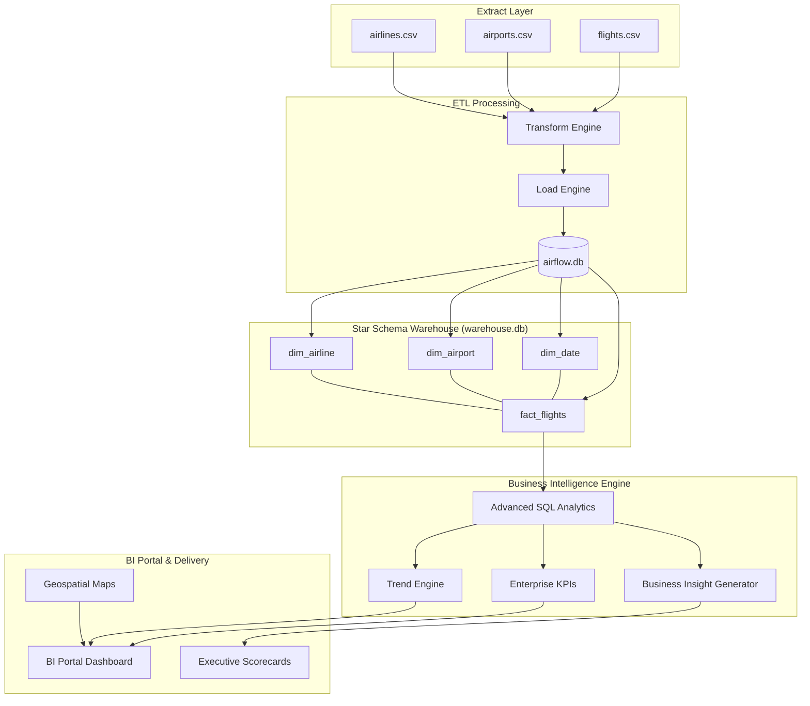

# Enterprise Data Warehouse Architecture Diagram

```mermaid
graph TD
    %% Data Sources Layer
    subgraph "Extract Layer"
        RAW_A[airlines.csv]
        RAW_P[airports.csv]
        RAW_F[flights.csv]
    end

    %% Transform & Load Layer
    subgraph "ETL Processing"
        T[Transform Engine]
        L[Load Engine]
        DB[(airflow.db)]
        RAW_A --> T
        RAW_P --> T
        RAW_F --> T
        T --> L
        L --> DB
    end

    %% Enterprise Data Warehouse Layer (Phase 9)
    subgraph "Star Schema Warehouse (warehouse.db)"
        DIM_A[dim_airline]
        DIM_P[dim_airport]
        DIM_D[dim_date]
        FACT[fact_flights]
        
        DB --> DIM_A
        DB --> DIM_P
        DB --> DIM_D
        DB --> FACT
        
        DIM_A --- FACT
        DIM_P --- FACT
        DIM_D --- FACT
    end

    %% Business Intelligence Layer
    subgraph "Business Intelligence Engine"
        SQL[Advanced SQL Analytics]
        TRENDS[Trend Engine]
        BI_METRICS[Enterprise KPIs]
        INSIGHTS[Business Insight Generator]
        
        FACT --> SQL
        SQL --> TRENDS
        SQL --> BI_METRICS
        SQL --> INSIGHTS
    end

    %% Output Layer
    subgraph "BI Portal & Delivery"
        PORTAL[BI Portal Dashboard]
        MAPS[Geospatial Maps]
        REPORTS[Executive Scorecards]
        
        BI_METRICS --> PORTAL
        TRENDS --> PORTAL
        MAPS --> PORTAL
        INSIGHTS --> REPORTS
    end
```
